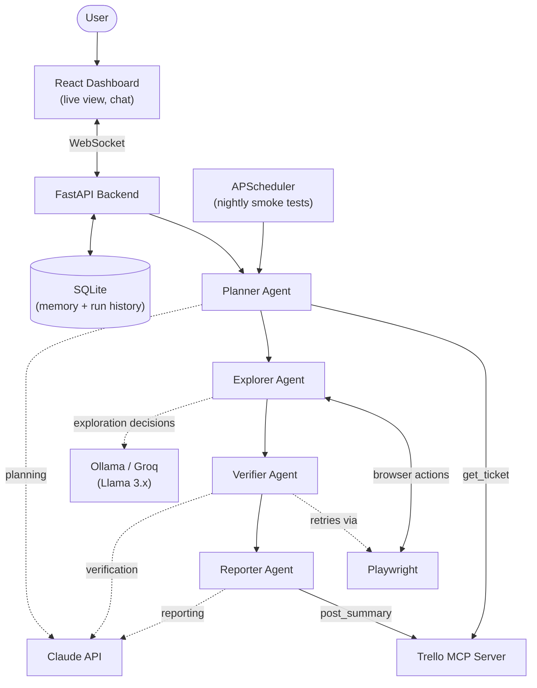

# ProTester

An AI agent that tests a live website the way a QA engineer would: it reads a Trello ticket describing what needs testing, plans a targeted test, drives a real browser through it, verifies every finding before reporting it, and posts results back to the ticket.

This is a Phase 3 capstone project for an AI-focused internship (Arbisoft). Full project proposal (problem statement, architecture rationale, milestones, risks) is available separately; this README covers what's needed to run and understand the code itself.

## Architecture



Four agents cooperate through a shared FastAPI backend, each with one narrow job:

- **Planner** — reads the Trello ticket (or a domain's saved workflows if none is given) and builds a prioritized test plan
- **Explorer** — drives Playwright against the live site, deciding each next action from the current page state, not a fixed script
- **Verifier** — re-runs the steps behind any flagged issue once before it's accepted as a confirmed bug
- **Reporter** — writes the final severity-ranked report and posts a summary back to the originating Trello ticket

Every run can be executed with **Claude alone or Claude + a local/hosted Llama model side by side**, so the same ticket produces two independently-run reports for direct comparison — see [Why these models](#why-these-models).

## What it does

- **Runs a real browser test from a Trello ticket** — full Planner → Explorer → Verifier → Reporter pipeline, streamed live to the dashboard over WebSocket, with a bounding-box overlay showing exactly what the agent is clicking as it happens.
- **Domain Knowledge** — save reusable, site-specific workflows (login, checkout, etc.) per domain so the Planner has real, human-verified context to test against instead of guessing blind on every run.
- **Trello Settings** — connect a Trello API key/token from the dashboard itself; falls back to a backend `.env` file if nothing's saved from the UI, so both a hosted, non-technical setup and a local dev setup work the same way.
- **Scheduler** — a fixed subset of each domain's workflows (marked `smoke: true`) can run unattended on an interval (nightly, hourly, etc.) via APScheduler, or be triggered on demand from the dashboard, so a regression surfaces on its own instead of waiting for the next real ticket.
- **Global chat assistant** — answers questions about how the project itself works or about a live site directly (grounded in real, current run history), and can kick off a new ticket run from plain language ("run ticket ABC123").
- **History, Analytics, and Model Comparison** — every run is stored with full step-by-step evidence (screenshots, timings, verdicts), a professional PDF report can be generated per run, and Claude-vs-Ollama/Groq runs on the same ticket are shown side by side.

## Frontend structure

```
frontend/src/
├── assets/       # static images/icons
├── components/   # reusable UI components used across pages (ReportCard, GlobalChat, LiveBrowserView, ...)
├── contexts/      # React context providers (auth, live pipeline run state)
├── hooks/        # custom hooks wrapping data-fetching/state logic
├── layouts/      # shared page layout wrappers (dashboard shell, sidebar nav)
├── pages/        # one file per screen (Dashboard, RunTest, History, Compare, Analytics,
│                 #   DomainKnowledge, TrelloSettings, Scheduler, LoginPage, ...)
├── routes/       # route definitions
├── services/     # API calls to the backend
├── tests/        # frontend tests (vitest)
├── types/        # shared TypeScript types/interfaces
├── utils/        # small standalone helper functions
└── App.tsx       # root shell + routing
```

## Tech stack

- **Frontend:** React + TypeScript, built with Vite
- **Backend:** Python, FastAPI
- **Browser automation:** Playwright
- **MCP:** a custom MCP server wrapping the Trello API
- **Storage:** SQLite (run history) + small local JSON/YAML files (Trello settings, domain knowledge) — no separate database service needed
- **Scheduling:** APScheduler
- **PDF reports:** ReportLab
- **LLMs:** Claude (Anthropic API) for planning/verification/reporting; Llama 3.x via local Ollama or Groq's hosted API for exploration

## Why these models

Two LLM roles, split by cost and how often each is called, not two providers for the sake of it:

- **Llama 3.x, via Ollama (local) or Groq (hosted)** — handles the Explorer's frequent, low-stakes decisions (what to click next, whether something looks off). High call volume, so it needs to be free/cheap and fast. `OLLAMA_BACKEND=groq` swaps in Groq's hosted API for genuinely fast inference when local CPU-only Ollama is too slow — same comparison arm, just faster hardware behind it.
- **Claude (Anthropic API)** — handles the Planner, Verifier, and Reporter's judgment-heavy calls (building a test plan, deciding whether a finding is real, writing the final report). Called far less often, so it's worth spending on a stronger model there.

Because both arms are wired end to end, a single ticket can be run in **both-mode** — Claude-only and Claude+Ollama/Groq side by side — producing one stacked report so the two approaches can be compared directly on the same real page.

## Running it locally

**Backend:**
```bash
cd backend
python3 -m venv venv
source venv/bin/activate
pip install -r requirements.txt
playwright install chromium
cp .env.example .env   # fill in the values you need - see below
uvicorn app.main:app --port 8000
```

**Frontend:**
```bash
cd frontend
npm install
npm run dev
```

Then open `http://localhost:5173` and log in (defaults to `admin`/`admin` unless `AUTH_USERNAME`/`AUTH_PASSWORD` are set in `backend/.env`). From the dashboard you can start a new test, browse history, compare models, check analytics, manage Domain Knowledge, connect Trello, and configure the scheduler — see [What it does](#what-it-does) above.

The backend also auto-generates interactive API docs at `http://localhost:8000/docs` (FastAPI's built-in OpenAPI/Swagger support) — no extra setup needed.

### Environment variables (`backend/.env`)

See `backend/.env.example` for the full annotated list. At minimum for a real run you'll want:

- `ANTHROPIC_API_KEY` — required for the Planner/Verifier/Reporter (Claude)
- `TRELLO_API_KEY` / `TRELLO_TOKEN` — only needed if you're not connecting Trello from the Trello Settings page in the dashboard instead
- `OLLAMA_HOST` / `OLLAMA_MODEL` — for local Explorer inference (defaults assume `ollama serve` with `llama3.2` pulled), **or** `OLLAMA_BACKEND=groq` + `GROQ_API_KEY` to use Groq's hosted Llama instead
- `SMTP_*` / `ALERT_EMAIL_*` — optional; without them, findings still get classified and posted to Trello, just no email alert
- `SMOKE_INTERVAL_MINUTES` / `SMOKE_PROVIDER` — optional; controls the scheduler's interval and which model arm the unattended smoke runs use

### Running individual agents directly (useful for debugging one stage at a time)

```bash
# Planner + Explorer only
python -m app.agents.run_explorer <ticket_id>

# ...+ Verifier
python -m app.agents.run_verifier <ticket_id>

# Full pipeline: Planner -> Explorer -> Verifier -> Reporter
python -m app.agents.run_reporter <ticket_id>
```

Each of these needs Ollama running locally (`ollama serve`, `ollama pull llama3.2`) unless `OLLAMA_BACKEND=groq` is set. In normal use, the dashboard's "New Test" page drives the same full pipeline over WebSocket instead of these CLI entry points.

## Tests

**Backend:**
```bash
cd backend
pytest tests/                 # all tests
pytest tests/unit             # unit only
pytest tests/functional       # functional (API) only
pytest tests/e2e              # real-browser end-to-end only
```

**Frontend:**
```bash
cd frontend
npx tsc --noEmit               # typecheck
npx oxlint                     # lint
npx vitest run                 # unit/component tests
npx playwright test            # real-browser e2e (needs the backend running)
```

## Project log

See `prompts.md` for a running log of significant AI prompts used to build this project.
