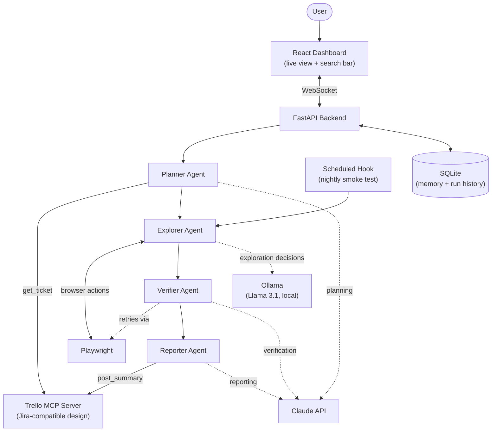

# ProTester

An AI agent that tests a live website the way a QA engineer would: it reads a Trello ticket describing what needs testing, plans a targeted test, drives a real browser through it, verifies every finding before reporting it, and posts results back to the ticket.

This is a Phase 3 capstone project for an AI-focused internship (Arbisoft). Full project proposal (problem statement, architecture rationale, milestones, risks) is available separately; this README covers what's needed to run and understand the code itself.

## Architecture



Four agents cooperate through a shared FastAPI backend, each with one narrow job:

- **Planner** — reads the Trello ticket (or a first look at the site if none is given) and builds a prioritized test plan
- **Explorer** — drives Playwright against the live site, deciding each next action from the current page state, not a fixed script
- **Verifier** — re-runs the steps behind any flagged issue once before it's accepted as a confirmed bug
- **Reporter** — writes the final severity-ranked report and posts a summary back to the originating Trello ticket

Day 1 stubbed the pipeline with a fake `/api/mock-run` endpoint so the frontend/backend wiring was proven before any real agent logic existed. Day 2 replaces that with a real Playwright-driven browser behind a WebSocket (`/ws/run`): the dashboard sends a URL, the backend launches a browser, navigates there, and streams live status updates back as it happens — the same live-connection pattern the four agents above will report through once they exist.

## Frontend structure

```
frontend/src/
├── assets/            # static images/icons
├── shared-components/ # reusable UI components used across pages
├── data/services/     # API calls to the backend
├── hooks/             # custom hooks wrapping data-fetching/state logic
├── layouts/           # shared page layout wrappers
├── pages/             # one file per screen (Dashboard, etc.)
├── routes/            # route definitions, once there's more than one page
├── tests/             # frontend tests
├── types/             # shared TypeScript types/interfaces
├── utils/             # small standalone helper functions
└── App.tsx            # thin root shell
```

Not every folder is populated yet — `layouts`, `routes`, `shared-components`, `tests`, and `utils` are empty placeholders for now, set up early so the project has a consistent place to grow into rather than needing a restructure later.

## Tech stack

- **Frontend:** React + TypeScript, built with Vite
- **Backend:** Python, FastAPI
- **Browser automation:** Playwright
- **MCP:** a custom MCP server wrapping the Trello API
- **Storage:** SQLite

## Why these models

Two LLMs, split by cost and how often each is called, not two providers for the sake of it:

- **Llama 3.1, run locally via Ollama** — handles the Explorer's frequent, low-stakes decisions (what to click next, whether something looks off). High call volume, so it needs to be free and fast.
- **Claude (Anthropic API)** — handles the Planner, Verifier, and Reporter's judgment-heavy calls (building a test plan from a ticket, deciding whether a finding is real, writing the final report). Called far less often, so it's worth spending on a stronger model there.

## Running it locally

**Backend:**
```bash
cd backend
python3 -m venv venv
source venv/bin/activate
pip install -r requirements.txt
playwright install chromium
uvicorn app.main:app --port 8000
```

**Frontend:**
```bash
cd frontend
npm install
npm run dev
```

Then open `http://localhost:5173`, enter a URL, and click "Run test" — the dashboard opens a WebSocket to the backend, which launches a real headless browser, navigates to that URL, and streams live status updates back until it reports the page's title.

The backend also auto-generates interactive API docs at `http://localhost:8000/docs` (FastAPI's built-in OpenAPI/Swagger support) — no extra setup needed.

**Explorer agent (needs Ollama running locally):**
```bash
ollama serve
ollama pull llama3.1
python -m app.agents.run_explorer <ticket_id>
```
This runs the Planner and Explorer back to back against a real ticket and prints the exploration log. `OLLAMA_HOST`/`OLLAMA_MODEL` in `.env` can point at a different host or model if needed.

**Verifier agent** (chains onto the above - no extra setup needed):
```bash
python -m app.agents.run_verifier <ticket_id>
```
Runs Planner → Explorer → Verifier back to back, reusing the Explorer's own live browser session for the Verifier's re-check, and prints the final pass/fail verdict.

**Reporter agent** (needs `SMTP_HOST`/`ALERT_EMAIL_TO` in `.env` to actually send alert emails - without them, findings still get classified and posted back to Trello, just no email):
```bash
python -m app.agents.run_reporter <ticket_id>
```
Runs the full pipeline (Planner → Explorer → Verifier → Reporter), prints the final severity-ranked report, and posts a summary back to the ticket.

## Project log

See `prompts.md` for a running log of significant AI prompts used to build this project.
